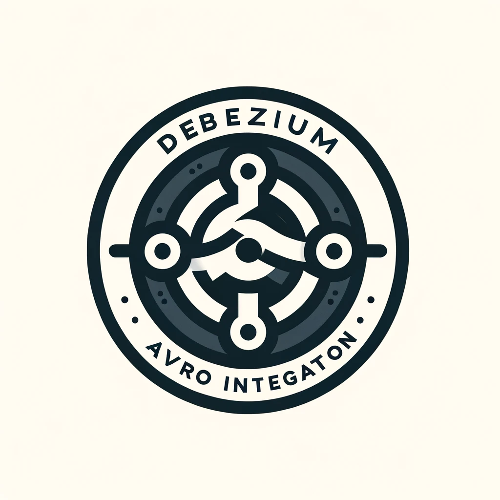

# Debezium Avro Integration

🎉 Explore the power of stream processing with Debezium Avro Integration! This project showcases the seamless integration between Debezium, an open-source distributed platform for change data capture (CDC), and Avro, a compact, fast, binary data format.

    

    
    

## Table of Contents 🏗️

- [Debezium Avro Integration](#debezium-avro-integration)
  - [Table of Contents 🏗️](#table-of-contents-️)
  - [Project Description 🌱](#project-description-)
  - [Project Usage 🧑‍💻](#project-usage-)
    - [Connecting Debezium to Kafka](#connecting-debezium-to-kafka)
    - [Connecting MySQL to Debezium as a Sink](#connecting-mysql-to-debezium-as-a-sink)
  - [Contributing 👥](#contributing-)
  - [License 📄](#license-)

## Project Description 🌱

Debezium Avro Integration demonstrates how to leverage Debezium for capturing changes in your databases in real-time and serializing the data using Avro format, which is not only compact but also supports schema evolution. By integrating with a schema registry, the project ensures that the schemas are consistently managed and compatible across different versions, enhancing data integrity and reliability in streaming architectures.

## Project Usage 🧑‍💻

### Connecting Debezium to Kafka

This section provides instructions on configuring Debezium to capture data changes from various sources and stream them to Kafka using Avro serialization. It's a foundational step for setting up real-time data pipelines that are robust, scalable, and maintainable.

### Connecting MySQL to Debezium as a Sink

This example demonstrates connecting MySQL to Debezium, allowing you to capture changes from MySQL databases efficiently. It showcases the setup and configuration necessary to start streaming data changes from MySQL to Kafka, utilizing Debezium and Avro for effective data representation and schema management.

## Contributing 👥

We welcome contributions to this repository! If you’re interested in contributing, please take a look at our [CONTIRIBUTION.md](CONTRIBUTING.md) file for more information on how to get started. We look forward to collaborating with you!

## License 📄

This repository is licensed under the MIT License, which is a permissive open-source license that allows for reuse and modification of the code with few restrictions. You can find the full text of the license in [this](LICENSE) file.
